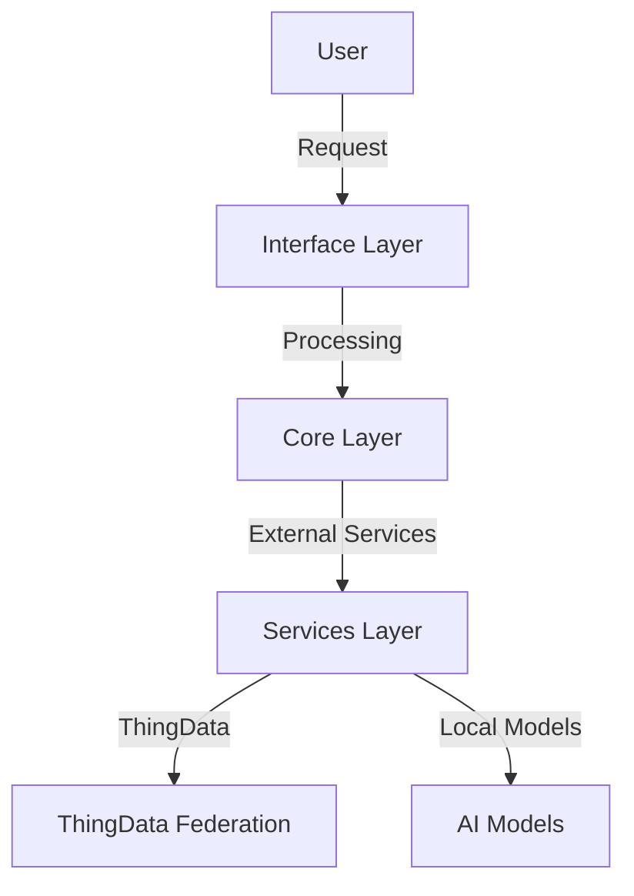

# docs/architecture/overview.md
# RITA Architecture Overview

## System Design

RITA is designed as a modular AI assistant that integrates with the ThingData ecosystem to provide repair guidance. The system is composed of three main layers:

### 1. Interface Layer
- **Web Interface**: FastAPI-based REST API
- **Vision Interface**: Image analysis for object/damage detection
- **Voice Interface**: Speech-to-text and text-to-speech

### 2. Core Layer
- **Chat Engine**: Manages conversation flow and context
- **Knowledge Integration**: Connects with ThingData federation
- **Safety System**: Validates and ensures safe repair advice

### 3. Services Layer
- **LLM Service**: Ollama-based language model processing
- **Vision Service**: YOLOv8-based image analysis
- **Voice Service**: Whisper-based speech processing

## Data Flow

